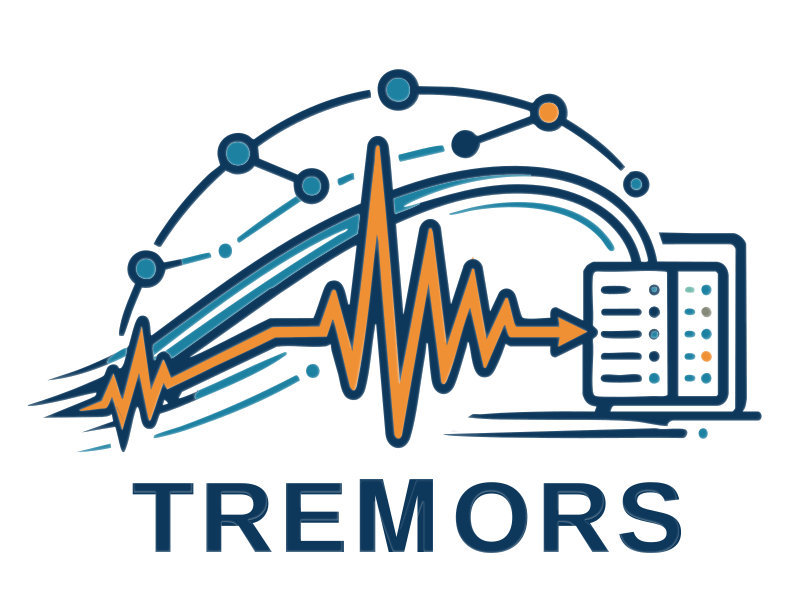

<div align="center">
  
</div>

# TREMORS

TREMORS (Text Referenced Event Mapping and Output Renderer for Seismographs) [](https://doi.org/10.48550/arXiv.2609.01777) 
is an agentic framework that leverages large language model reasoning within a constrained LangGraph execution graph to automate seismic data retrieval.

Natural language queries are translated into a structured intermediate schema, which drives a reproducible, auditable workflow for waveform (event-based/continuous) and metadata acquisition.

Approved for unlimited release LA-UR-26-23557

---

## Requirements

- Python ≥ 3.11
- An LLM backend: an Anthropic-compatible gateway (the CLI default),
  [Ollama](https://ollama.com) for local models, or any OpenAI-compatible
  endpoint (OpenAI, LiteLLM, etc.)

---

## Environment Setup

TREMORS supports both Conda and standard Python environments via `uv`.

### Option 1: Conda / Mamba (recommended)

```bash
conda env create --name tremors --file environment.yml
conda activate tremors
```

Or with Mamba:

```bash
mamba env create --name tremors --file environment.yml
mamba activate tremors
```

### Option 2: `uv` + Virtual Environment (lightweight)

Install `uv`:

```bash
curl -Ls https://astral.sh/uv/install.sh | sh
```

Create and activate an environment:

```bash
uv venv --python 3.11
source .venv/bin/activate   # macOS/Linux
# .venv\Scripts\activate    # Windows
```

Install TREMORS:

```bash
uv pip install .
```

Optional dev dependencies:

```bash
uv pip install -e ".[dev]"
```

> **Notes:**
> - Dependencies are installed from `pyproject.toml`
> - System tools like Ollama must be installed separately

---

## Installation

After environment setup, install the package to make the `tremors` command available:

```bash
pip install -e .
tremors --help
```

---

## Ollama Setup

TREMORS supports local LLMs via Ollama. Choose the install method that fits your environment:

### Option 1: System Install (requires sudo)

```bash
curl -fsSL https://ollama.com/install.sh | bash
```

### Option 2: Local Install (no sudo)

```bash
bash scripts/install-ollama-nosudo.sh --install-dir /home/user/ollama
```

> Replace `/home/user/ollama` with your desired install path.

### Option 3: Conda

Ollama is included in `environment.yml` — if you used Conda/Mamba for setup, you already have it and can skip this step.

To install manually:

```bash
conda install -c conda-forge ollama
```

> **Note:** GPU acceleration may not be available depending on how the package was compiled. Use Options 1 or 2 for guaranteed GPU support.

### Start Ollama

Pull a model (only needs to be done once):

```bash
ollama pull gpt-oss:20b  # Or any model from https://ollama.com/library
```

Then start the server:

```bash
ollama serve &
```

> We've only tested with OpenAI-compatible models (e.g. `gpt-oss:20b`, `gpt-oss:120b`). Other models served by Ollama may work but are untested.

Check available models:

```bash
ollama list
```

---

## Usage

As a library, `TremorsAgent` takes whatever LangChain chat model you hand it, so
any of these work:

| Backend | Endpoint | Credential |
|---------|----------|-----------------|
| **Anthropic / gateway** | Public API, or an internal proxy | `ANTHROPIC_API_KEY` or `ANTHROPIC_AUTH_TOKEN` |
| **Ollama** | `http://localhost:11434/v1` | — |
| **OpenAI** | Official API | `OPENAI_API_KEY` |
| **LiteLLM** | Proxy for OpenAI, Anthropic, Gemini, etc. | Varies |

(The `tremors` CLI defaults to the Anthropic backend — see
[Command-Line Interface](#command-line-interface).)

### Basic Example

> This example uses Ollama, but you can substitute any OpenAI-compatible provider — just swap `base_url`, `api_key`, and `model`.

```python
from langchain_openai import ChatOpenAI
from tremors import TremorsAgent

llm = ChatOpenAI(
    base_url="http://localhost:11434/v1",  # Replace with your provider's endpoint
    api_key="ollama",                      # Replace with your API key
    model="gpt-oss:20b",                   # Replace with your model name
    temperature=0.7,
)

agent = TremorsAgent(llm=llm, output_dir="./output")
result = agent.run(
    "Retrieve waveforms for the 10 largest earthquakes along the "
    "Cascadia Subduction Zone between 2010 and 2020 and plot them."
)
```

`run()` returns a result dict (`status`, `error`, `queried_dcs`,
`metadata_tables`, `plots`, `waveforms_saved`, `waveform_plots`, …).

### Pausing for approval in a notebook

The agent asks before it retrieves anything (see
[Human-in-the-loop](#human-in-the-loop)). At the terminal the CLI prompts; in a
notebook or library there are two ways to handle a pause:

```python
from tremors import TremorsAgent, approve_all

# 1. Handle it inline: on_interrupt is called with the pending request and
#    returns the answer, so run() completes in one call.
result = agent.run(query, on_interrupt=approve_all)

# 2. Or let run() return, inspect, and continue when ready.
result = agent.run(query)
while result["status"] == "Awaiting Input":
    print(result["interrupt"])                     # what is being asked
    result = agent.resume(approve_all(result["interrupt"]))
```

Use `approve_all` rather than a hand-written `lambda`: the resume value needs
**one decision per pending tool call**, and a clarification pause takes a plain
answer string, not a decision list. `approve_all` handles both, and refuses to
auto-answer a clarification — approving a plan the verifier called unusable is
not a decision a default gets to make. To answer one yourself, branch on
`payload["kind"] == "clarification"` and return the missing detail as a string.

Pass `interrupts=False` to `TremorsAgent(...)` to turn the gates off entirely.
Plan verification still runs, and a plan it rejects still stops the run.

---

## How a query is resolved

1. **Plan.** The query is translated into a structured `SearchParams` object
   (`src/tremors/utils/params.py`) via the backend's structured-output support,
   falling back to JSON-in-text validated against the same schema when a provider
   doesn't implement it. The log line names which path ran.
2. **Verify.** `verify_search_params` rejects plans that are schema-valid but
   cannot be right — an inverted bounding box, a magnitude window that excludes
   everything, a single point with no search radius, an unknown datacenter. This
   **fails closed**: a rejected plan never reaches the datacenters. With gates
   enabled the agent asks you to clarify and re-plans once.
3. **Cascade.** Event queries fan out to the four global datacenters (USGS, EMSC,
   GEOFON, ISC) plus any regional node whose coverage overlaps the search area,
   in parallel. A datacenter that errors or times out is logged, left out of
   `queried_dcs`, and does not stop the run.
4. **Convert and plot.** Catalogs and inventories become KBCore-style parquet
   tables (`EVENT.PARQUET`, `ORIGIN.PARQUET`, …), then maps, timelines, and
   waveform figures.

### Duplicate events are kept, not merged

Every reporting datacenter's version of an earthquake is retained. One quake
reported by USGS, EMSC, GEOFON and ISC is **four rows** in `EVENT.PARQUET` and
four markers on the map, each carrying its own `datacenter` provenance value.

This is deliberate: the reported origin time, location, depth and magnitude
differ between agencies, and collapsing them would silently discard the
differences an analyst may be after. To work with one row per event, group on
`datacenter` and pick your preferred authority:

```python
import pandas as pd

origins = pd.read_parquet("./output/ORIGIN.PARQUET")
usgs    = origins[origins["datacenter"] == "USGS"]
```

---

## Command-Line Interface

TREMORS ships a `tremors` CLI. It is designed to be driven both by hand and by a
script or agent harness — every command has a `--json` mode whose contract is
documented in **[CLI.md](CLI.md)**, a hands-on walkthrough ordered cheapest-first.

```bash
pip install -e .        # puts `tremors` on your PATH
tremors --help
```

| Command | What it does |
|---------|--------------|
| `tremors query QUERY` | Run one natural-language query |
| `tremors config` | Show or store backend connection settings |
| `tremors resume` | Answer a paused run and continue it |
| `tremors sessions` | List or delete durable sessions |

### First run: point it at a backend

The default backend is **`anthropic`**, which targets any Anthropic-compatible
gateway and therefore has no built-in endpoint or model. It needs three values:
`api_key`, `base_url`, `model`. Each resolves independently in this order:

**CLI flag → environment variable → config file → built-in default**

```bash
# Store the stable ones once (written 0600 to ~/.tremors/config.json)
tremors config --save --base-url https://gateway.example --model my-model-id
tremors config --save --api-key -        # read from stdin: no shell history, no process table

tremors config                           # what is in effect, and where each value came from
tremors config --json                    # same, machine-readable, with `missing` / `ready`
```

Connection settings (`model`, `base_url`, `api_key`, `temperature`) are stored
**per backend**, because they are not interchangeable — a gateway model id means
nothing to ollama. `backend` and `output_dir` are shared. So several backends can
coexist and you switch with one flag:

```bash
tremors config --save --backend ollama --model gpt-oss:20b
tremors query "..." --backend ollama
```

The config file **fails closed**: malformed JSON, a non-object, or an unknown key
(e.g. `base-url` for `base_url`) exits 5 rather than being silently ignored —
quietly falling back to defaults could send the query to the wrong service. The
stored API key is never printed back, only whether one is set.

| Backend | Endpoint | Credential |
|---------|----------|------------|
| `anthropic` *(default)* | `--base-url` / `ANTHROPIC_BASE_URL` (required) | `ANTHROPIC_API_KEY`, or `ANTHROPIC_AUTH_TOKEN` |
| `openai` | public API, or `OPENAI_BASE_URL` | `OPENAI_API_KEY` |
| `ollama` | `http://localhost:11434/v1` | — |

> **Preflight check.** Before the query runs, every backend gets one cheap
> connectivity ping. A bad key, unreachable endpoint, or unknown model exits
> immediately with a clear (secret-safe) message instead of failing mid-run.
> Pass `--no-preflight` to skip it.

### `tremors query` — one-shot query

```bash
tremors query "M5+ earthquakes near Japan in 2020"
tremors query "M5+ earthquakes near Japan in 2020" -o ./out -v

# Event catalog + waveforms + plots, against a local Ollama server
tremors query "Find 2 unique events in Northern California from 2016 with \
magnitude > 5.0. Get waveforms and plot them." \
    -o ./temp --backend ollama --model gpt-oss:20b --base-url http://localhost:11438/v1
```

Cost a query before authorizing it — one planner LLM call, no FDSN request, no
files written, no gates:

```bash
tremors query "M6+ earthquakes near Japan in 2020" --plan-only
```

It reports the verified search parameters and the datacenters the cascade *would*
fan out to.

### Human-in-the-loop

TREMORS asks before it downloads anything. Gates are **on by default** and stop
the run at the last moment before a request leaves the machine:

| Gate | When | Choices |
|------|------|---------|
| **Clarification** | The plan failed verification (see [How a query is resolved](#how-a-query-is-resolved)) | Type the missing detail; the query is re-planned once |
| **Event query** | Before the first FDSN catalog call | approve / edit parameters / reject / quit |
| **Bulk download** | Before a continuous multi-process download | approve / edit parameters / reject / quit |

Each approval gate prints the resolved search parameters (the bulk gate also
prints the day span, channel selection, worker count and output directory) so you
can see what you are approving.

- **edit** takes a JSON object of overrides, e.g. `{"min_mag": 6.0,
  "max_date": "2020-06-30"}`, merged over the plan.
- **reject** takes a reason, which is handed back to the model so it re-plans.
- **quit** exits immediately, having retrieved nothing.

```bash
tremors query "M5+ earthquakes near Japan in 2020" --yes    # approve everything
tremors query "M5+ earthquakes near Japan in 2020" \
    --no-interrupts                                         # no gates at all
```

`--yes` cannot answer a *clarification* — approving a plan the verifier called
unusable is not a decision a flag gets to make, so the run stops and tells you
what to add to the query.

### Unattended and cross-process runs

Without a terminal (piped, cron, CI, an agent harness) a gate does not block on
stdin. It exits **4** with the pending question in the result document instead.
Give the run a `--session-id` and that pause becomes durable — a later process
picks it up and answers it:

```bash
tremors query "M6+ near Japan in 2020" --session-id demo1 --json > paused.json   # exit 4
tremors resume --session-id demo1 --show                       # what is it waiting for?
tremors resume --session-id demo1 --approve                     # or --reject REASON / --clarify TEXT
```

The session remembers the query, backend, model, base URL and output directory,
so `resume` needs no other flags. Sessions live under `~/.tremors`
(`--session-dir` to move them) and are listed by `tremors sessions`.

Under `--json`, **stdout carries exactly one JSON document and nothing else**;
all human-facing output, including `-v` debug logging, goes to stderr. Branch on
the document's `outcome` (a small closed vocabulary) rather than on `status`
(free-form prose from whichever tool ran last). The exit code carries the same
taxonomy:

| Code | Outcome | Meaning |
|------|---------|---------|
| `0` | `success`, `no_data` | Ran to completion. **A query that legitimately matched nothing is not an error.** |
| `1` | `failed`, `unknown` | The run failed. |
| `2` | — | Usage error (bad flags, unknown session, wrong answer kind). |
| `3` | `clarification_required` | The plan needs a human detail. |
| `4` | `awaiting_input` | Paused at a gate. Resumable if `--session-id` was given. |
| `5` | `config_error` | Missing or untrustworthy settings. |
| `6` | `aborted` | The user declined and the run stopped. |

Full worked examples, the complete document key list, and the rest of the
harness contract are in **[CLI.md](CLI.md)**. `tremors <command> --help` lists
every flag.

---

## Evals

The behavioral eval suite runs offline by default — no network, no LLM, no API
key:

```bash
python evals/run_evals.py                 # all cases + unit checks
python evals/run_evals.py -k continuous   # only matching cases
python evals/run_evals.py -k unit:        # only the library unit checks
python evals/run_evals.py --list
```

A stub model follows the pipeline's own next-step hints, and a fake FDSN service
serves the QuakeML fixtures in `evals/fixtures/` while applying the query filters
a real node would. Each case asserts two independent things: the artifacts
(tables exist, rows fall inside the requested window / box / magnitude floor) and
the tool trajectory (a continuous request must never run `query_cascade`).

A handful of `unit:` checks run first and cover library helpers the agent cases
can't reach offline — that a day of waveform data containing a gap still gets
written, and that a datacenter fallback is reflected in the provenance column.

To exercise a real backend and real datacenters:

```bash
python evals/run_evals.py --live --backend ollama --model gpt-oss:20b
```

> There is no pytest/ruff/black configuration in this repo — `run_evals.py` is a
> standalone script.

---
## Useful Ollama Commands

```bash
ollama list         # list models
ollama rm <model>   # remove model
```

---

## Troubleshooting

### No GPU Detected

Ollama will fall back to CPU automatically. No action needed, but performance will be slower.

### Port Conflict (default port 11434 already in use)

Start Ollama on a different port:

```bash
OLLAMA_HOST=127.0.0.1:<PORT> ollama serve
```

> Replace `<PORT>` with an available port number (e.g. `11435`).

Then update your client config to match:

```python
base_url="http://localhost:<PORT>/v1"
```
